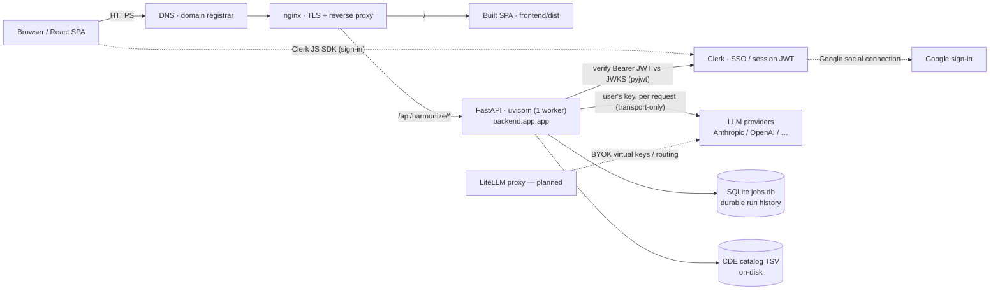

# ddharmon.io — Deployment Architecture

How the pieces of the live app connect. This is the **public** overview (no hosts, keys, or other
secrets). Operators: the real values live in the internal runbook (private repo), and the step-by-step
deploy/redeploy/promote commands live in the `deploy-ddharmon` runbook.

## Two repos, one app

- **`ddharmon`** — the core harmonization library (published to PyPI).
- **`ddharmon-ui`** (this repo) — the web app: a FastAPI backend + a built React SPA. It depends on the
  core through a version pin (`ddharmon[all]>=…`). A UI-only change ships without touching core; a core
  change reaches the app only after it's published (prod) or pinned to a git ref (dev — see Channels).

The app runs as a single small VM: nginx terminates TLS and reverse-proxies **one** uvicorn worker that
serves both the JSON API (`/api/harmonize/*`) and the SPA (`frontend/dist`). LLM calls are **BYOK** — each
user supplies their own provider key at runtime; **the server holds no LLM key**.

## Request flow

The browser authenticates with **Clerk directly** via its JS SDK; the backend only **verifies** the
resulting JWT against Clerk's JWKS. The progress stream is Server-Sent Events, so nginx runs with
`proxy_buffering off` on the API location.

## Channels

Two fully isolated instances on the same VM — each with its own systemd unit, port, nginx vhost, and
`.env`. A dev deploy never touches prod.

| Channel | URL | Core pin | Auth |
|---|---|---|---|
| **prod** | ddharmon.io | the **PyPI** release | Clerk SSO + guest demo mode |
| **dev** | dev.ddharmon.io | an **unreleased git ref** on the core repo | Clerk SSO, **org-domain gated** (no guest) |

There is also a backend-less **Netlify static preview** — a client-side replay of committed demo fixtures
(no server, no keys) for marketing/demo.

**Why the split:** prod tracks the stable PyPI release; dev pins the core to an unreleased GitHub ref so
cross-repo (core + UI) work is validated end-to-end *before* a PyPI release. Promotion is one-directional:
validate on dev → publish core to PyPI → repin + deploy prod.

## Services

Each entry: what it does · why · where its config/secrets live · failure mode.

### Compute — cloud VM (AWS Lightsail)
Single Linux VM hosting both channels. Chosen for simplicity: a low-traffic tool that must run **one**
worker (the in-memory job registry + SSE rule out multi-worker/autoscale). Config = systemd units + nginx
site files on the box. **Fails:** VM/unit down → 502 on that channel; systemd (`Restart=always`) respawns a
crashed worker.

### nginx + certbot (TLS)
Terminates HTTPS, reverse-proxies uvicorn, serves the SPA at `/`. certbot auto-renews Let's Encrypt certs.
`proxy_buffering off` on the API path keeps SSE live. **Fails:** cert lapse → TLS errors (auto-renew guards
this); vhost misconfig → 502.

### FastAPI app (uvicorn, one worker)
`backend.app:app` — the JSON API + static SPA. **Never scale past one worker** (splits the in-memory store,
breaks SSE). Config: a per-channel `.env` with Clerk vars and **no** LLM key (BYOK). **Fails:** worker dies →
respawned; any *in-flight* run is flipped to `error` on reboot with its uploads kept for a one-click re-run.

### Clerk — authentication
SSO (session JWT) plus a guest demo mode (prod). Sign-in happens in the browser via the Clerk JS SDK; the
backend is stateless and just **verifies** the Bearer JWT against Clerk's JWKS (pyjwt). Google sign-in is a
Clerk social connection. Config: the **publishable key** is baked into the frontend build (`VITE_*`); the
issuer and an optional org-domain guard live in the backend `.env`. **Fails:** a frontend build **missing the
publishable key** turns the client gate off (renders open, sends no token) while the backend gate stays on →
every API call returns `401 "Missing authentication token"` and the model catalog comes back empty. Always
build with the channel's Clerk key.

### Domain / DNS — registrar
The apex domain and the dev subdomain resolve to the VM. **Fails:** DNS misconfig → unreachable even while
the app is healthy.

### LLM providers — BYOK (LiteLLM proxy planned)
Every run uses the **user's** provider key, passed as a transport-only header per request — never stored or
logged. A LiteLLM proxy gateway is planned to normalize multi-provider routing and issue BYOK virtual keys.
**Fails:** a bad user key errors only that run; no server-side blast radius.

### Persistence & assets
- **Run history** — a SQLite `jobs.db` under the work root. Signed-in users' completed runs are written
  through and **survive** a `git pull` + restart; a restart only interrupts *in-flight* runs. Only a fresh
  clone into a new deploy dir (or deleting the DB) wipes history.
- **CDE catalog** — a large TSV kept on the box (gitignored); a run with a non-empty CDE set needs it present.
- Demos re-seed on every boot; guest (not-signed-in) runs are ephemeral.

## Deploying (high level)

- **prod** — SSH → `git pull` main → rebuild the SPA and/or upgrade the core pin *only if they changed* →
  restart the unit.
- **dev** — `git pull` the feature/integration branch → reinstall the pinned core **git ref** → rebuild the
  SPA → restart the dev unit.
- **static preview** — `scripts/deploy-preview.sh` (Netlify; on-call only).

Exact hosts, unit names, env keys, and the dev→prod promotion sequence are in the internal runbook and the
`deploy-ddharmon` operational guide.
